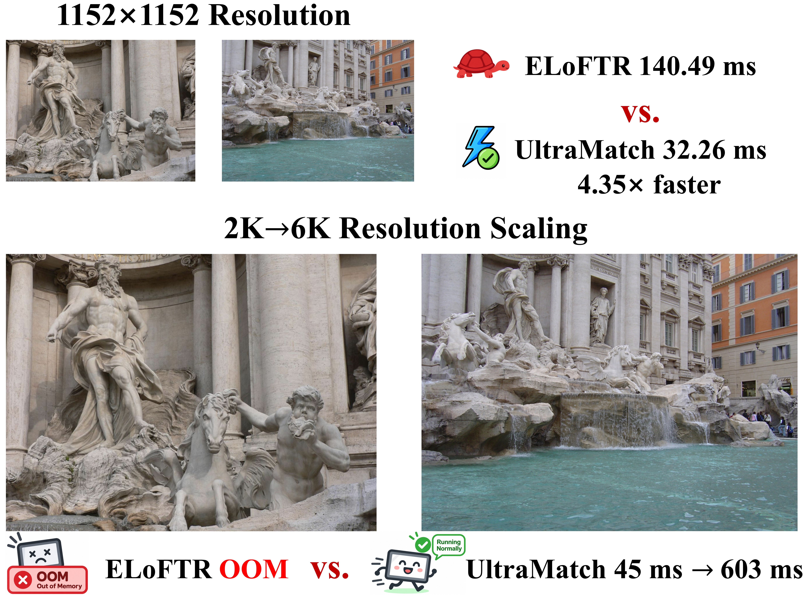
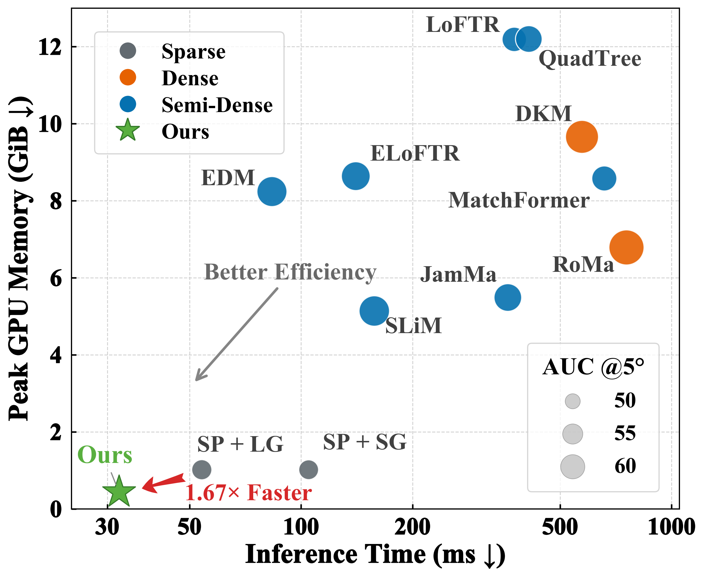
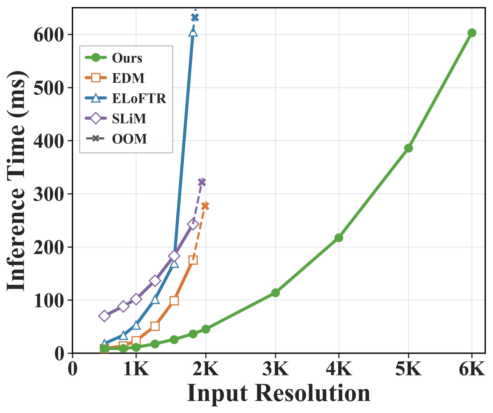
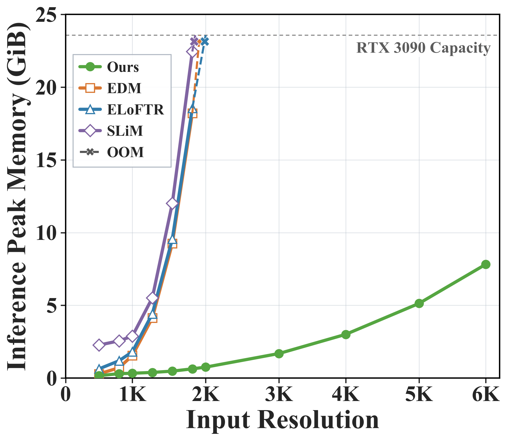
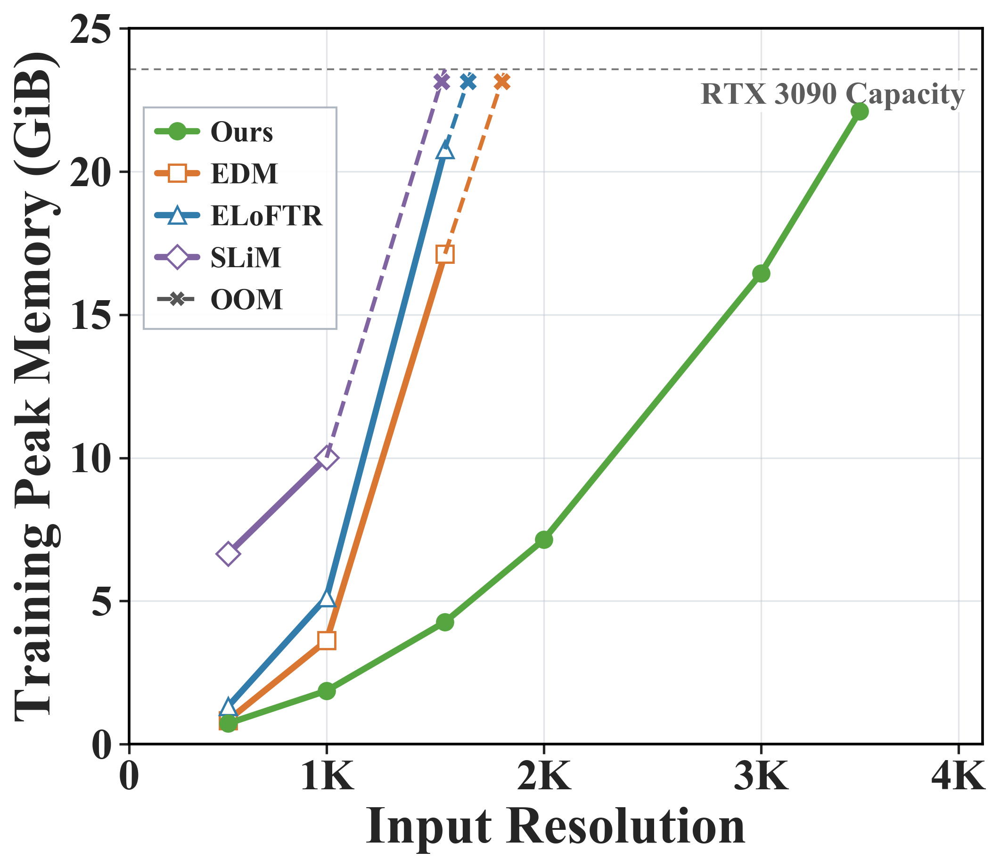
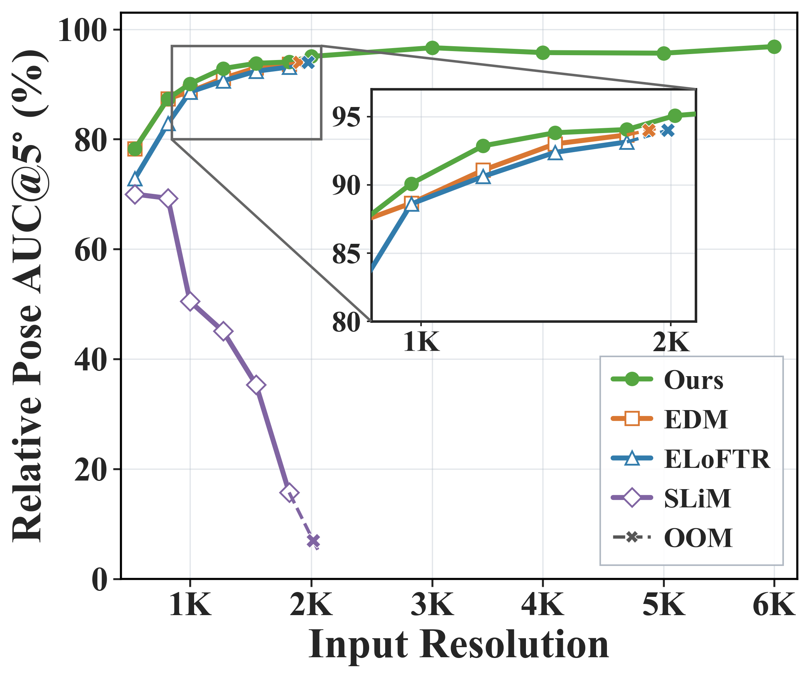
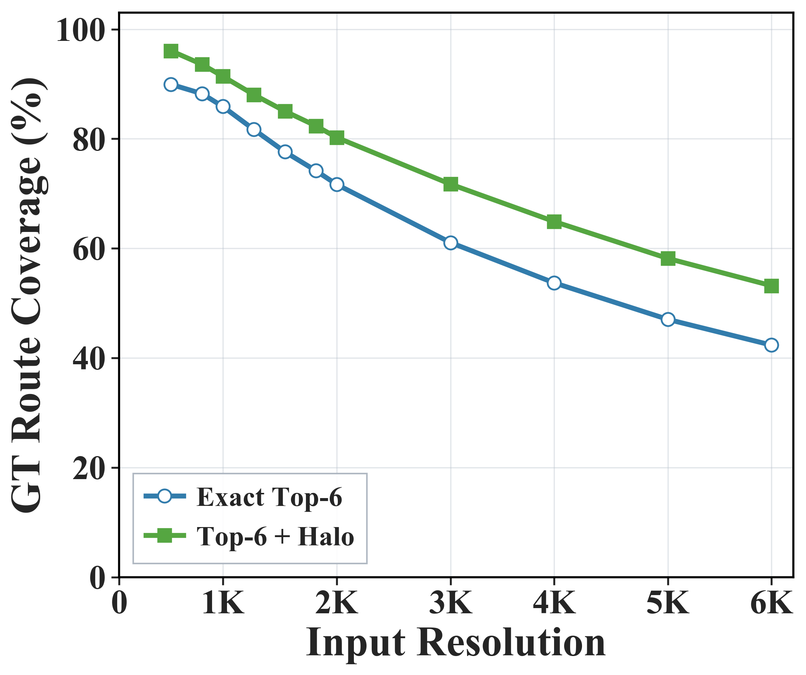
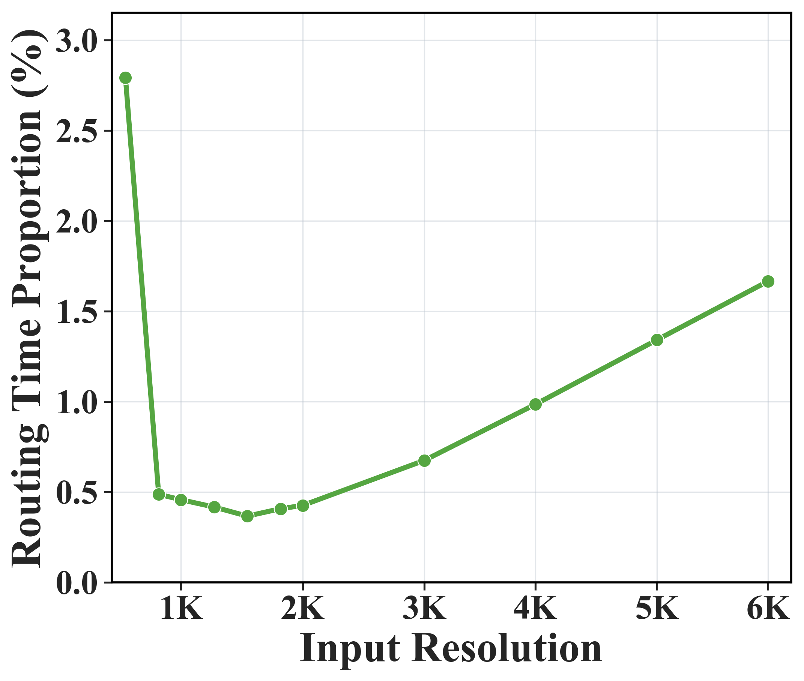

<h1 align="center">UltraMatch: Transport Path Routing for Ultra-Fast and Memory-Efficient Image Matching</h1>

<h3 align="center">
  <a href="https://scholar.google.com/citations?user=uWhzrG4AAAAJ&hl=zh-CN">Jiajun Le</a><sup>1</sup> &middot;
  <a href="https://scholar.google.com/citations?user=h-9Ub_cAAAAJ&amp;hl=zh-CN">Yifan Lu</a><sup>1</sup> &middot;
  <a href="https://scholar.google.com/citations?user=bxuEALEAAAAJ&amp;hl=zh-CN">Zizhuo Li</a><sup>1</sup> &middot;
  <a href="https://scholar.google.com/citations?user=LaT72N4AAAAJ&amp;hl=zh-CN&amp;oi=sra">Lei Cao</a><sup>1,2</sup> &middot;
  <a href="https://scholar.google.com/citations?user=WNH2_rgAAAAJ&amp;hl=zh-CN">Junjun Jiang</a><sup>3</sup> &middot;
  <a href="https://scholar.google.com/citations?user=73trMQkAAAAJ&amp;hl=zh-CN&amp;oi=sra">Jiayi Ma</a><sup>1,4,*</sup>
</h3>

<p align="center">
  <sup>1</sup>Electronic Information School, Wuhan University<br>
  <sup>2</sup>Xiaomi Corporation<br>
  <sup>3</sup>School of Computer Science and Technology, Harbin Institute of Technology<br>
  <sup>4</sup>School of Robotics, Wuhan University
</p>

<p align="center">
  <sup>*</sup>Corresponding author
</p>

<p align="center">
  <a href="https://arxiv.org/abs/2609.36980"></a>
  <a href="https://github.com/JiajunLe/UltraMatch"></a>
  <a href="#code-release"></a>
  <a href="#citation"></a>
</p>


## News

**[2026-09-29]** The UltraMatch paper has been submitted to arXiv. The public paper link and arXiv citation will be added after announcement.

## Overview

**UltraMatch is an efficient, scalable semi-dense image matcher that routes computation to a small set of promising matching paths.** Instead of constructing a full token-to-token matching matrix, a lightweight **Transport Path Router** ranks candidate target blocks for each source block and retains only a small subset. Matching then runs over the selected paths.

<p align="center">
  
</p>


In the reported experiments, UltraMatch is **1.67x faster than SuperPoint+LightGlue** and **4.35x faster than ELoFTR**, with **0.44 GiB** peak inference memory on MegaDepth-1500. On ETH3D, it supports image pairs at **6048 x 4032** resolution on a single RTX 3090. The routing strategy can be readily **integrated into other semi-dense matchers**.

## Results

### Accuracy and efficiency

<p>
  
  
</p>
<br clear="all">

### High-resolution scalability

<p align="center">
  
  
  
</p>
<p align="center">
  
  
  
</p>

### Transferability of Transport Path Routing


AUC, runtime, and memory are shown as **Original / Routing**.

| Method | AUC@10° ↑ | End-to-end (ms) ↓ | Coarse matching (ms) ↓ | Memory (GiB) ↓ |
| :--- | :---: | :---: | :---: | :---: |
| ELoFTR | 71.2 / **71.9** | 141.61 / 76.41 (**1.85×**) | 77.88 / 7.46 (**10.44×**) | 8.64 / 2.02 (**−76.6%**) |
| JamMa | 70.6 / **71.3** | 362.64 / 187.05 (**1.94×**) | 204.54 / 7.05 (**29.02×**) | 5.49 / 1.43 (**−74.0%**) |
| SLiM | **69.2** / 68.5 | 193.30 / 147.30 (**1.31×**) | 59.72 / 14.22 (**4.20×**) | 5.14 / 4.06 (**−21.0%**) |
| EDM | 71.2 / **72.1** | 83.58 / 41.56 (**2.01×**) | 47.74 / 4.73 (**10.09×**) | 8.24 / 0.60 (**−92.7%**) |

## Code Release

**The paper is currently under review, so the code and pretrained weights have not yet been released.** This repository currently contains the project overview and paper results. Release updates, installation instructions, and usage documentation will be posted here when available.

You can **Watch** this repository for updates. For questions about the project, contact [Jiajun Le](mailto:jiajunle01@gmail.com) or the corresponding author, [Jiayi Ma](mailto:jyma2010@gmail.com).

## Citation

If you find UltraMatch useful in your research, please cite our work. 

```bibtex
@article{le2026ultramatch,
  title={UltraMatch: Transport Path Routing for Ultra-Fast and Memory-Efficient Image Matching},
  author={Le, Jiajun and Lu, Yifan and Li, Zizhuo and Cao, Lei and Jiang, Junjun and Ma, Jiayi},
  journal={arXiv preprint arXiv:2609.36980},
  year={2026}
}
```
